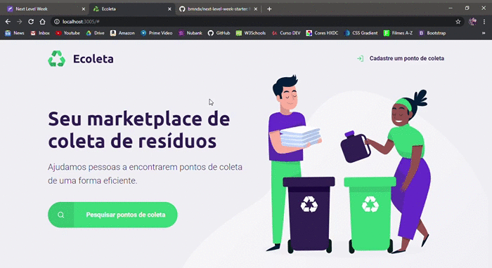

<h1 align="center">
    Next Level Week by 
    </h1>
  
  

  

_________

### 🤔 Mas o que é isso? 
A NLW é uma experiência online criada pela Rocketseat de uma semana com muito conteúdo prático, desafios, hacks e um projeto que nos ajudam a avançar para o próximo nível e impulsionar a nossa carreira.
  
### ✨ Sobre o projeto:

O Ecoleta é um projeto criado para gerenciar o processo de coleta de lixo nas cidades. Com ele, é possível ajudar pessoas a encontrarem pontos de coleta de uma forma mais eficiente.
  
### 👀 Meu aprendizado durante o evento:
(dia 1) - Hoje é o primeiro dia do NLW, onde já desenvolvemos a home page do projeto utilizando HTML e CSS. Apesar de já ter conhecimento nessas duas tecnologias, eu pude revisar conceitos básicos e colocá-los em prática novamente. Tive a oportunidade de conhecer outros devs que estão participando do evento, compartilhar conhecimentos, ideias, etc.

(dia 5 e último) - Ufa!! Que semana! Ao longo desses 5 dias eu tive uma imersão total neste projeto incrível. Aprendemos como utilizar Javascript, Git, NodeJS, Nunjucks, banco de dados, etc. Cada conhecimento novo foi muito valioso, pois já estarei aplicando em projetos futuros que estarei realizando a partir de agora. Só tenho a agradecer a Rocketseat e aos outros devs que conheci ao longo dessa semana por ter me proporcionado essa experiência única!
 
<h2 align="center"> 📷 GIF do projeto: </h2>

_________
<h4 align="center"> Projeto finalizado ❤ </h4>

